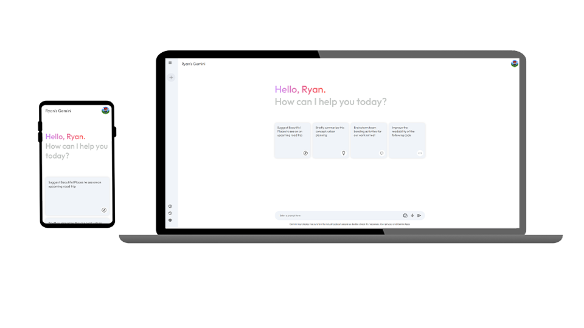
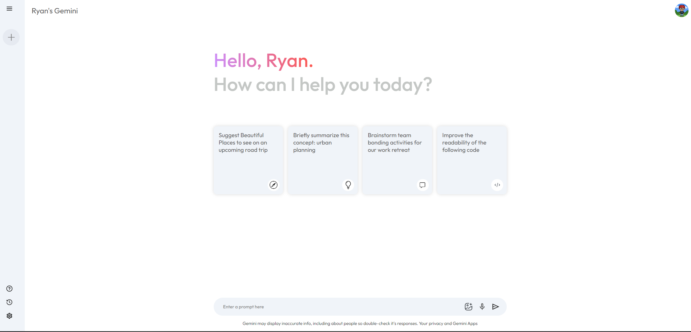
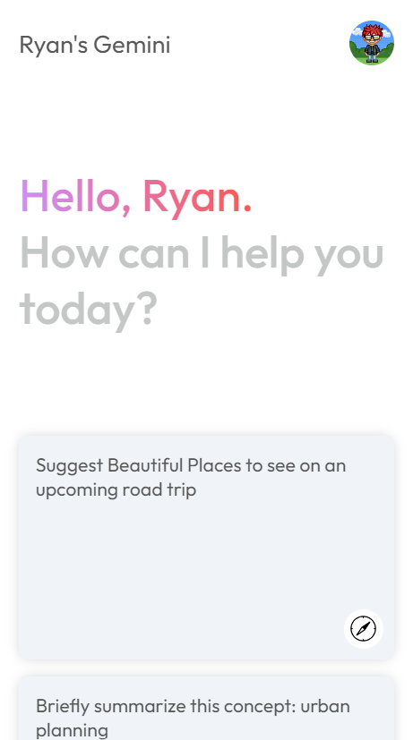
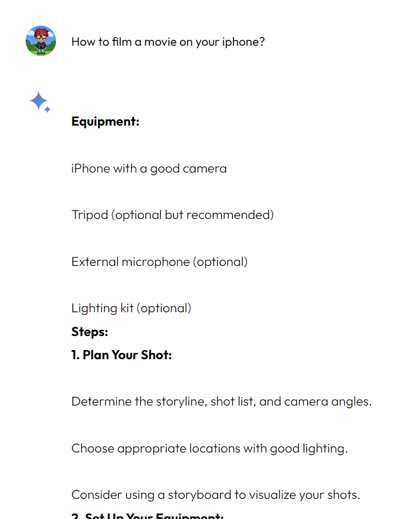
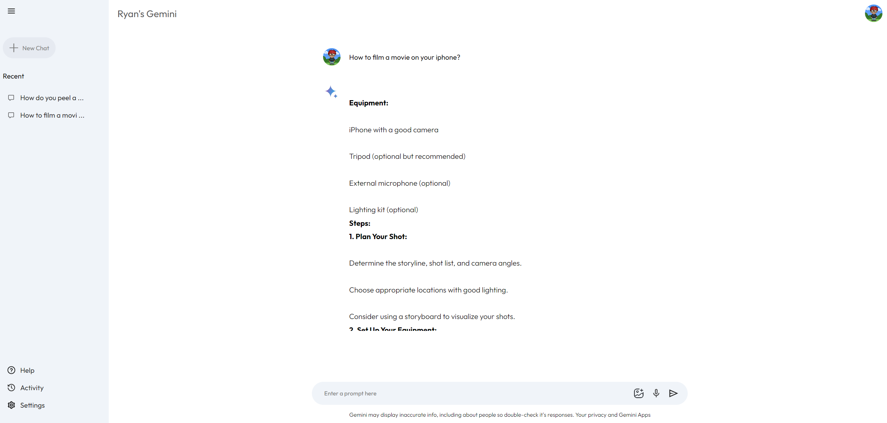

# Ryan's Gemini Clone

Welcome to the frontier of Artificial Intelligence (AI)! In today's rapidly evolving technological landscape, AI stands out as a transformative force that promises to reshape countless industries and aspects of our lives. This remarkable technology has captured the imagination of innovators worldwide, and I am thrilled to join the ranks with my own AI-powered project. Inspired by the cutting-edge advancements in AI, I embarked on a journey to develop a project that leverages the power of Google's API for Gemini. With the guidance of the esteemed GreatStack, I meticulously crafted a working clone that showcases the immense potential of AI. As you delve into this project, I invite you to share your thoughts and experiences. What AI-related endeavors have captured your interest? Reach out to me through the contact section below and let's engage in a vibrant discussion on the future of AI.

---

## Screenshots

Click Here to view More 

The Main Page:

Mobile View

Answering a Prompt:

Sidebar displaying Previous Prompts:

---

## Links

[Deployed Site](https://gemini-ryan.netlify.app/)

[My Portfolio](https://ryanfann.netlify.app/)

---

## Credits

[GreatStack on Youtube](https://youtu.be/0yboGn8errU?si=kSoeluQBop9vMMKP)

## Contact

Use my Contact Page on My Portfolio here:

_or_

via [GitHub](https://github.com/8BitGinger)

_or_

[Gmail](mailto:ryan.fann@gmail.com)

---

powered by: 
